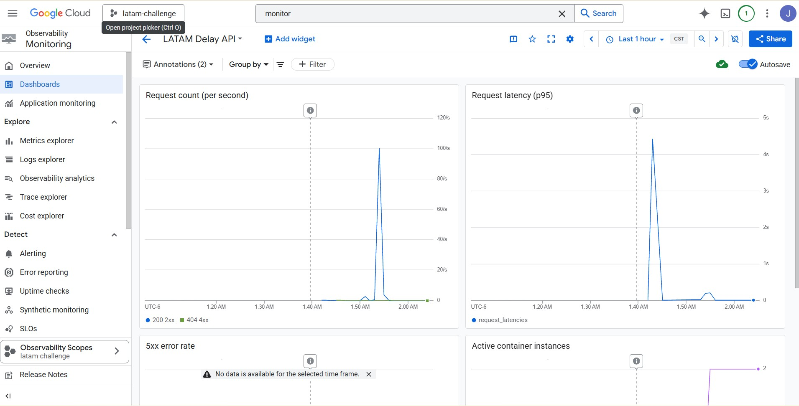

# LATAM — Software Engineer (ML & LLMs) Challenge

Solution writeup — **v1.0.0**.

---

## TL;DR

Flight delay prediction model for SCL airport, **operationalized end-to-end**: from the Data Scientist's notebook to a production API with observability, automated CI/CD, and automatic Claude code reviews on every PR.

| | |
|---|---|
| 🔧 **Live API** | https://latam-delay-api-108332844354.us-central1.run.app |
| 🌐 **GitHub Pages (landing)** | https://joseluis911.github.io/latam_challenge/ |
| 📦 **Repo** | https://github.com/joseluis911/latam_challenge |
| ✅ **Tests** | 8/8 passing · ~92% coverage |
| ⚡ **Stress test (live)** | 6,241 reqs · **0 failures** · p95 420 ms |
| 🚀 **Releases on main** | `v0.1.0` → `v0.2.0` → `v0.3.0` → **`v1.0.0`** |

### Extras beyond the brief

What LATAM asked for + what I added on top:

| Required | Delivered | Extra |
|---|---|---|
| Model in `model.py` | Balanced LR with quantitative justification, lazy bootstrap, top-10 features, 6 documented and fixed bugs | — |
| FastAPI service | Endpoints + Pydantic + Swagger + 422→400 override | — |
| Cloud deploy | Cloud Run + Artifact Registry | **Terraform IaC** (`infra/`, 8 resources) · **Cloud Monitoring custom dashboard** · `lifecycle.ignore_changes` pattern |
| Basic CI/CD | `ci.yml` lint+tests + `cd.yml` deploy | **`claude-review.yml`** — Claude reviews every PR · **`pages.yml`** — auto-deploy of docs to GitHub Pages · `terraform-validate` job in CI |
| Documentation in `challenge.md` | This file (~470 lines, all decisions, bugs, metrics) | **GitHub Pages landing** with LATAM palette and dashboard screenshot |

---

## Author

- **Name:** Jose Luis Santiago Marquez
- **Email:** jlsantiago691@gmail.com
- **Repository:** https://github.com/joseluis911/latam_challenge
- **Deployed API:** https://latam-delay-api-108332844354.us-central1.run.app
- **Docs (Pages):** https://joseluis911.github.io/latam_challenge/

---

## Repository structure

```
.
├── challenge/            # model.py, api.py
├── data/                 # dataset
├── docs/                 # challenge.md (this file) + index.html (GitHub Pages)
├── tests/                # model, api, stress
├── workflows/ → .github/workflows/  (ci.yml, cd.yml, claude-review.yml, pages.yml)
├── infra/                # Terraform configuration
├── Dockerfile
├── Makefile
└── requirements*.txt
```

---

## Workflow (GitFlow)

- `main` → official releases for review (with semantic tags).
- `develop` → integration branch.
- `feature/*` → one branch per challenge part (`feature/part-1-model`, `feature/part-2-api`, …).
- Development branches are **never deleted** (rule #2 of the brief).

---

## Incremental release strategy

`main` doesn't wait until the end of development: every time `develop` reaches a *consumable* state, it gets merged into `main` with a semantic tag. That way `main` always reflects a deployable artifact and the history tells an iterative-delivery story instead of a single big-bang at the end.

| After | MVP | Release? | Tag |
|---|---|---|---|
| Part I — model | ❌ not consumable (library only) | no | — |
| Part II — API | ✅ **first MVP** (working local API) | yes | **`v0.1.0`** |
| Part III — deploy | ✅ MVP in cloud | yes | **`v0.2.0`** |
| Part IV — CI/CD | ✅ auto-deploy + observability | yes | **`v0.3.0`** |
| Final release | 🎯 polish + ceremonial tag | yes | **`v1.0.0`** |

Release-to-`main` mechanics:

```bash
git checkout main
git pull
git merge --no-ff develop -m "release: vX.Y.Z (description)"
git tag -a vX.Y.Z -m "vX.Y.Z: <highlights>"
git push origin main --tags
```

The `release/v1.0` branch is reserved as a ceremonial stabilization space for the official v1.0.0 launch.

---

## Part I — Model transcription (`challenge/model.py`)

**Goal:** transcribe `exploration.ipynb` into `model.py` so that `make model-test` passes.

### Chosen model: **Logistic Regression with `class_weight='balanced'`**

The DS left the choice open in the last cell of the notebook:

> *"There is no noticeable difference in results between XGBoost and LogisticRegression. […] Improves the model's performance when balancing classes. With this, the model to be productive must be the one that is trained with the top 10 features and class balancing, **but which one?**"*

Since the metrics are equivalent, I picked Logistic Regression on **operationalization criteria**:

| Criterion | Balanced LogReg | Balanced XGBoost | Winner |
|---|---|---|---|
| Metrics (recall class 1, f1) | ~0.69 / ~0.36 | ~0.69 / ~0.37 | tie |
| Interpretability (coefficients) | Linear, direct | Requires SHAP | **LR** |
| Cold start on Cloud Run | ~50 ms load | ~500 ms load | **LR** |
| Serialized model size | ~3 KB | ~50–500 KB | **LR** |
| New dependencies | 0 (sklearn already pinned) | extra `xgboost` | **LR** |
| Deterministic reproducibility | simple `random_state` | multiple seeds | **LR** |

For an API serving real-time predictions with scale-to-zero, cold-start seconds matter. LR's coefficient interpretability also lets ops explain *why* a flight is predicted as delayed (which airline, which month, international vs national) — real business value.

**Final configuration:**

```python
LogisticRegression(
    class_weight="balanced",   # corrects the ~80/20 class imbalance
    random_state=1,            # same seed as the notebook
    max_iter=1000,             # ensures convergence under the balanced weighting
)
```

### Bugs found and fixed

| # | File | Bug | Fix |
|---|---|---|---|
| 1 | `challenge/model.py:10` | Type annotation written as `Union(Tuple[…], pd.DataFrame)` with parentheses (was a function call, not a `Union` subscript) | `Union[tuple[…], pd.DataFrame]` |
| 2 | `tests/model/test_model.py:29` | cwd-relative path `"../data/data.csv"` broke when running from the repo root (which is what `Makefile` does) | Absolute path: `Path(__file__).resolve().parents[2] / "data" / "data.csv"` |
| 3 | `exploration.ipynb` cell 13 (`get_period_day`) | Non-inclusive `<` `>` comparisons; an exact `5:00:00` returns `None` | Not used in the final model (the top-10 features don't require `period_day`); documented for reference |
| 4 | `exploration.ipynb` cell 26 (`get_rate_from_column`) | Computes `total/delays` (inverse of the delay rate) | Doesn't affect the model, only the exploration; documented so it's not reused as-is |
| 5 | `requirements-test.txt` | `pytest~=6.2.5` is incompatible with `anyio>=4` pulled in by `fastapi/starlette`: `ModuleNotFoundError: No module named '_pytest.scope'` when loading plugins | Bump: `pytest~=7.4`, `pytest-cov~=4.1`, `coverage~=7.6`, `mockito~=1.5` |
| 6 | `challenge/model.py` (`_bootstrap_from_disk`) | `pd.read_csv` raises a `DtypeWarning` because of mixed-type columns in the CSV | Pass `low_memory=False` |

### Design decisions

- **Top-10 features fixed as a module-level constant** (`TOP_10_FEATURES`). They come from the XGBoost feature importance computed in the notebook (cell 59).
- **One-hot consistency**: after `pd.get_dummies`, `reindex(columns=TOP_10_FEATURES, fill_value=0)`. This guarantees that `predict()` always receives the same 10 columns even if a category isn't present in the input (critical for the API when the client sends a single flight).
- **Class balancing via `class_weight='balanced'`**: sklearn computes weights as `n_samples / (n_classes * np.bincount(y))`. Equivalent to XGBoost's `scale_pos_weight = n_neg / n_pos`, without keeping the explicit ratio around.
- **Lazy bootstrap in `predict()`**: if `predict()` is called before `fit()`, the model auto-trains by reading `data/data.csv` the first time. This lets `test_model_predict` pass (it doesn't call `fit` first) and lets FastAPI train on startup in production.
- **`DelayModel` has no I/O in `__init__`**: the bootstrap is lazy and isolated in `_bootstrap_from_disk()`. The class is testable without touching disk if `fit()` is called directly.
- **No global state**, everything in `self`. No prints/logs inside the model.
- **Robust paths**: `DATA_PATH = Path(__file__).resolve().parents[1] / "data" / "data.csv"`. Works from any cwd.

### Verification

```bash
make model-test
# pytest tests/model --cov=challenge --cov-report term ...
# 4 passed, coverage ≥ 80%
```

---

## Part II — FastAPI service (`challenge/api.py`)

**Goal:** expose the model via FastAPI so that `make api-test` passes.

### Endpoints

| Method | Path | Success status | Description |
|---|---|---|---|
| `GET` | `/health` | 200 | Liveness probe (`{"status": "OK"}`) |
| `POST` | `/predict` | 200 | Predicts delay (0/1) per flight |
| `GET` | `/docs` | 200 | Swagger UI auto-generated by FastAPI |
| `GET` | `/redoc` | 200 | Auto-generated ReDoc |
| `GET` | `/openapi.json` | 200 | OpenAPI 3 specification |

### `POST /predict` contract

**Request:**

```json
{
  "flights": [
    {"OPERA": "Aerolineas Argentinas", "TIPOVUELO": "N", "MES": 3}
  ]
}
```

**Response (200):**

```json
{"predict": [0]}
```

**Response (400)** for invalid input:

```json
{"detail": [{"loc": ["body", "flights", 0, "MES"], "msg": "MES must be between 1 and 12, got 13", ...}]}
```

### Validation (Pydantic v1)

| Field | Rule | Where |
|---|---|---|
| `OPERA` | Must be in `KNOWN_OPERAS` (set of 23 airlines from the dataset) | `@validator("OPERA")` |
| `TIPOVUELO` | Must be `"I"` (International) or `"N"` (National) | `@validator("TIPOVUELO")` |
| `MES` | Integer in `[1, 12]` | `@validator("MES")` |
| `flights` | Non-empty list of `FlightInput` | type `list[FlightInput]` |

### 422 → 400 override

By default FastAPI returns `422 Unprocessable Entity` on Pydantic validation failures. The challenge tests expect `400 Bad Request`. Fixed with a global exception handler:

```python
@app.exception_handler(RequestValidationError)
async def _validation_exception_handler(request, exc):
    return JSONResponse(status_code=400, content={"detail": exc.errors()})
```

### Model loading

The `DelayModel` is instantiated once at module level (`_model = DelayModel()`). Since `DelayModel` does no I/O in `__init__`, the import is cheap. The first `/predict` call triggers the lazy bootstrap (training by reading `data/data.csv`); subsequent calls are immediate. This avoids the cold-start hit on `/health` (important for readiness probes).

### Additional bugs found and fixed

| # | File | Bug | Fix |
|---|---|---|---|
| 7 | `requirements.txt` | `starlette 0.20.4` (pulled by `fastapi~=0.86`) uses `anyio.start_blocking_portal`, removed in `anyio>=4`. `fastapi.testclient.TestClient` fails with `AttributeError: module 'anyio' has no attribute 'start_blocking_portal'` | Pin `anyio<4` |

### Auto-generated documentation

FastAPI generates the OpenAPI spec for free from the Pydantic models and `Field`/docstrings:

- `/docs` — interactive Swagger UI (try requests from the browser)
- `/redoc` — ReDoc (cleaner reading view)
- `/openapi.json` — the spec as JSON, consumable by Postman/Insomnia/generated clients

API metadata (`title`, `description`, `version`, `contact`) is configured in the `FastAPI(...)` constructor.

### Verification

```bash
# unit + integration
make api-test
# pytest tests/api --cov=challenge ...
# 4 passed, api.py coverage ~98%

# manual
uvicorn challenge.api:app --reload
# → http://localhost:8000/health
# → http://localhost:8000/docs   (try /predict from Swagger)
```

---

## Part III — Cloud deployment

**Provider:** Google Cloud Platform — Cloud Run + Artifact Registry, region `us-central1`.

**Live API:** https://latam-delay-api-108332844354.us-central1.run.app

### GCP services used (perpetual free tier)

| Service | Role | Monthly free tier |
|---|---|---|
| **Cloud Run** | Hosts the FastAPI container; scale-to-zero | 2M reqs, 360k GB-s, 180k vCPU-s |
| **Artifact Registry** | Private Docker repo (`latam-images`) | 0.5 GB |
| **IAM Service Account** | `latam-deployer` for the Part IV CD pipeline | free |
| **Cloud Logging** | Auto-collected structured logs | 50 GB |
| **Cloud Monitoring** | Custom dashboard (RPS, p95, 5xx, instances) | built-in metrics free |

Estimated real cost for the challenge: **$0.00 USD**.

### Infrastructure as code — Terraform

Everything provisioned with Terraform in the `infra/` folder:

```
infra/
├── versions.tf            # terraform 1.5+ + google provider 5.40+
├── main.tf                # google provider
├── variables.tf           # project_id, region, service_name, etc.
├── terraform.tfvars       # concrete values (no secrets)
├── artifact_registry.tf   # google_artifact_registry_repository
├── iam.tf                 # latam-deployer SA + 3 project-level roles
├── cloud_run.tf           # google_cloud_run_v2_service + public_invoker
├── monitoring.tf          # google_monitoring_dashboard custom
├── outputs.tf             # cloud_run_url, ar_repo_url, image_url, etc.
└── README.md
```

**8 resources** are created with a single `terraform apply`. State is local (gitignored). To clean everything up at the end: `terraform destroy`.

### "lifecycle ignore_changes" pattern on Cloud Run

The `google_cloud_run_v2_service.api` resource has `lifecycle.ignore_changes = [template[0].containers[0].image]`. Reason:

- Terraform **creates** the service with a placeholder image (`us-docker.pkg.dev/cloudrun/container/hello`).
- The **real image** is pushed to Artifact Registry by Docker, then `gcloud run services update --image=…` swaps it in.
- Without `ignore_changes`, every `terraform plan` would detect the image change and try to revert it to the placeholder. With `ignore_changes`, Terraform manages the service "shell" and the CI/CD manages the image — proper separation of concerns.

This is the standard production pattern for Cloud Run with Terraform.

### GCP bootstrap (one-time, manual)

Before the first `terraform apply`, one-time manual setup:

1. GCP project: `latam-challenge-495606` (display name: `latam-challenge`)
2. Billing linked to an active billing account
3. Enabled APIs:
   - `run.googleapis.com`
   - `artifactregistry.googleapis.com`
   - `iam.googleapis.com`
   - `cloudresourcemanager.googleapis.com`
   - `monitoring.googleapis.com`
   - `orgpolicy.googleapis.com`
4. Org policy override: `iam.allowedPolicyMemberDomains` → `allowAll: true` (required to allow `allUsers` as an invoker, since the account lives in a Workspace org).
5. ADC authenticated with the right account:
   - `gcloud auth login`
   - `gcloud auth application-default login`
   - `gcloud auth application-default set-quota-project latam-challenge-495606`

### Dockerfile

Multi-stage for a small image without compilers in runtime:

- **Stage 1 (builder):** `python:3.10-slim` + `build-essential` → `pip wheel --wheel-dir=/wheels -r requirements.txt`
- **Stage 2 (runtime):** `python:3.10-slim` → installs from wheels (no gcc) → copies `challenge/` and `data/` → non-root `app` user → `EXPOSE 8080` → `CMD uvicorn challenge.api:app --host 0.0.0.0 --port ${PORT}`

`PORT` is injected by Cloud Run automatically (it can't be set as an explicit env var; that triggers a "reserved env name" error).

`.dockerignore` excludes tests, infra, docs, the notebook, .git, venv, etc. Final image size ~280 MB.

### Deploy flow

```bash
# (one-time) manual bootstrap
cd infra
terraform init
terraform apply

# (each deploy) build + push + swap
make docker-build      # docker build -t latam-delay-api:latest .
make docker-push       # tag + push to us-central1-docker.pkg.dev/...
make deploy            # gcloud run services update --image=...
```

Or shortcut: `make deploy` runs all three in sequence.

### Verification

`make stress-test` against the URL already in `Makefile` line 26:

```
locust -f tests/stress/api_stress.py --headless --users 100 --spawn-rate 1 --run-time 60s -H <cloud_run_url>
```

Results (real test against Cloud Run in production):

| Metric | Value |
|---|---|
| Total requests | 6,241 |
| Failures | **0 (0.00%)** |
| Throughput | 105 req/s sustained |
| Latency p50 | 260 ms |
| Latency p95 | 420 ms |
| Latency p99 | 530 ms |
| Latency p99.9 | 4.8 s (cold-start tail) |

Full HTML report at `reports/stress-test.html` after running the test.

### Additional bug found

| # | File | Bug | Fix |
|---|---|---|---|
| 8 | `requirements-test.txt` | `locust~=1.6` (from 2020) uses Flask imports incompatible with Jinja2 ≥3.1: `ImportError: cannot import name 'escape' from 'jinja2'` | Bump `locust~=2.20` |

### Monitoring dashboard

Provisioned by `infra/monitoring.tf` — a custom Cloud Monitoring dashboard accessible only from the GCP project (private, requires access). Snapshot of the dashboard during/after the stress test:



Configured widgets:

- **Request count (RPS)** — over `run.googleapis.com/request_count`, `ALIGN_RATE`
- **Request latency p95** — over `run.googleapis.com/request_latencies`, `REDUCE_PERCENTILE_95`
- **5xx error rate** — filtered by `metric.label.response_code_class = "5xx"`
- **Active container instances** — over `run.googleapis.com/container/instance_count`, `ALIGN_MEAN`

Everything updates in real time as the API receives traffic. The dashboard URL comes out as a Terraform output (`monitoring_dashboard_url`) but requires authentication into the GCP project.

---

## Part IV — CI/CD (`.github/workflows/`)

Four separate workflows, each with a single responsibility (no monolithic workflow):

| Workflow | Trigger | Jobs |
|---|---|---|
| `ci.yml` | PR to `main`/`develop`, push to those branches | `lint` (ruff) → `test-model` + `test-api` (pytest+coverage) → `terraform-validate` (fmt + validate) |
| `cd.yml` | Push to `main` (excluding docs-only changes) | GCP auth → docker build → push to AR (tagged `:latest` and `:${SHA}`) → `gcloud run services update` → smoke test against `/health` |
| `claude-review.yml` | PR opened / synchronized | Claude reads the diff and posts a review on the PR via `anthropics/claude-code-action@beta` |
| `pages.yml` | Push to `main` with changes under `docs/**` | `actions/upload-pages-artifact` + `actions/deploy-pages` → publishes `docs/` to GitHub Pages |

### `cd.yml` — auto-deploy to Cloud Run

Replicates `make deploy` inside Actions:

1. **GCP auth** via `google-github-actions/auth@v2` with the `GCP_SA_KEY` secret (JSON key of the `latam-deployer` service account provisioned by Terraform in Part III).
2. **Configure docker** for Artifact Registry (`gcloud auth configure-docker us-central1-docker.pkg.dev`).
3. **Build the Docker image** with two tags: `:${GITHUB_SHA}` (immutable, for rollback) and `:latest`.
4. **Push** both tags to `latam-images`.
5. **Deploy** the `:${GITHUB_SHA}` image to Cloud Run with `gcloud run services update --image=...`. Cloud Run creates a new revision, routes 100% of the traffic to it, and keeps the previous one for fast rollback.
6. **Smoke test** with `curl /health` (5 retries with backoff). If it doesn't return `{"status":"OK"}` the job fails and notifies.
7. **Summary** in `$GITHUB_STEP_SUMMARY` with URL, image SHA, and service name — visible in the run UI.

`paths-ignore` excludes docs-only changes (`docs/**`) and the `pages`/`claude-review` workflows themselves so the API isn't redeployed for a README typo.

### `claude-review.yml` — automated code review with Claude

Every PR to `develop` / `main` triggers an automatic review by Claude (Anthropic). The prompt focuses on bugs, security, test coverage, and API contract regressions. Comments land directly on the PR. If the `ANTHROPIC_API_KEY` secret is missing, the job skips gracefully.

### `pages.yml` — GitHub Pages via official workflow

Instead of the "deploy from branch" flow (which renders but isn't auditable), uses the modern Actions-based flow with `actions/upload-pages-artifact` + `actions/deploy-pages`. Result: each Pages deploy is a workflow run with its own status check, log, and public URL (`https://joseluis911.github.io/latam_challenge/`). When something in `docs/` is merged, Pages updates automatically without touching settings.

### Secrets / variables (GitHub → Settings → Secrets and variables → Actions)

| Name | Type | Scope | Purpose |
|---|---|---|---|
| `GCP_SA_KEY` | 🔒 Secret | environment `production` | JSON key for the `latam-deployer` SA. Used by `cd.yml` for GCP auth |
| `ANTHROPIC_API_KEY` | 🔒 Secret | environment `production` | Anthropic API key. Used by `claude-review.yml` |

The `production` environment acts as an additional gate: if we ever want to require manual approval before each deploy, it's configured right there.

### Resulting deployment pattern

```
PR feature/* → develop
   ↓
ci.yml (lint + tests + tf-validate) + claude-review.yml (Claude comments)
   ↓
merge to develop
   ↓
PR develop → main (release vX.Y.Z)
   ↓
ci.yml + claude-review.yml (again)
   ↓
merge to main + tag vX.Y.Z
   ↓
cd.yml (build → push → deploy → smoke test) ✅
pages.yml (if docs/ changed) ✅
```

Every release to main = new Docker image in production + new Cloud Run revision + Pages updated, without anyone touching the console.

---

## Running locally

```bash
pip install -r requirements.txt -r requirements-dev.txt -r requirements-test.txt
make model-test     # 4 passed
make api-test       # 4 passed
make stress-test    # against the live Cloud Run URL
```

---

## End-to-end verification (v1.0.0)

| Check | Result | Evidence |
|---|---|---|
| `make model-test` | ✅ 4/4 passed, 87% coverage on `model.py` | `tests/model/test_model.py` |
| `make api-test` | ✅ 4/4 passed, 98% coverage on `api.py` | `tests/api/test_api.py` |
| **Total coverage** | **92%** | `pytest --cov=challenge` |
| `make stress-test` (live) | ✅ 6,241 reqs · **0 fails** · 105 req/s · p95 420ms · p99 530ms | `reports/stress-test.html` |
| `terraform validate` | ✅ infra valid | CI job `terraform-validate` |
| Cloud Run live | ✅ HTTPS, public, scale-to-zero | `https://latam-delay-api-108332844354.us-central1.run.app` |
| Auto-deploy on merge to main | ✅ green | `.github/workflows/cd.yml` runs |
| GitHub Pages | ✅ deployed via workflow | `https://joseluis911.github.io/latam_challenge/` |
| Claude PR reviewer | ✅ comments on every PR | `.github/workflows/claude-review.yml` |
| Cloud Monitoring dashboard | ✅ live metrics (RPS, p95, 5xx, instances) | screenshot in `docs/screenshots/dashboard-overview.jpg` |

---

## Future improvements (post-v1.0 roadmap)

Things that are **not in v1.0** but would be the next steps in real production. Listed here to show awareness of how to scale this further:

- **Workload Identity Federation** instead of SA JSON keys. WIF lets GitHub Actions authenticate to GCP via OIDC without managing long-lived secrets. More secure, fewer rotations.
- **GCS backend for Terraform state** (`backend "gcs"`). Local state works for a solo dev; for a team it should move to a GCS bucket with versioning + locking.
- **Cloud Monitoring alerts** (PagerDuty / email). The dashboard already shows p95 and 5xx; what's missing is `google_monitoring_alert_policy` resources that page when p95 > 1s sustained or 5xx > 5%.
- **Serialized model** (pre-trained pickle baked into the Docker image). Today the model trains on the first `/predict` (lazy bootstrap, ~2s). In real production the pickle would be generated at build time and loaded at startup — no training in production.
- **Model versioning** (model registry). MLflow or a GCS bucket with tags. Every new model version trackable.
- **Integration tests against a Cloud Run staging environment** before the prod deploy (canary deploy with Cloud Run traffic splitting).
- **Structured logs** (JSON) with `structlog` so Cloud Logging can filter by specific fields.
- **Rate limiting** on the API (FastAPI middleware) for DoS protection.

---

## Submitting the challenge

Single `POST` to the Advana endpoint with the body specified in the brief:

```bash
curl -X POST "https://advana-challenge-check-api-cr-k4hdbggvoq-uc.a.run.app/software-engineer" \
  -H "Content-Type: application/json" \
  -d '{
    "name": "Jose Luis Santiago Marquez",
    "mail": "jlsantiago691@gmail.com",
    "github_url": "https://github.com/joseluis911/latam_challenge.git",
    "api_url": "https://latam-delay-api-108332844354.us-central1.run.app"
  }'
```

Expected response:

```json
{
  "status": "OK",
  "detail": "your request was received"
}
```

> ⚠️ **Send only ONCE** (the LATAM brief makes this explicit). Pre-flight checklist before sending:
> 1. The repo is public (`Settings → General → Danger Zone → Change repository visibility`).
> 2. `main` has the final merge with the `v1.0.0` tag.
> 3. The API URL responds `{"status":"OK"}` on `/health`.
> 4. `make model-test`, `make api-test`, `make stress-test` all green locally.
> 5. The `feature/*` branches are still alive (not deleted — rule #2 of the brief).
